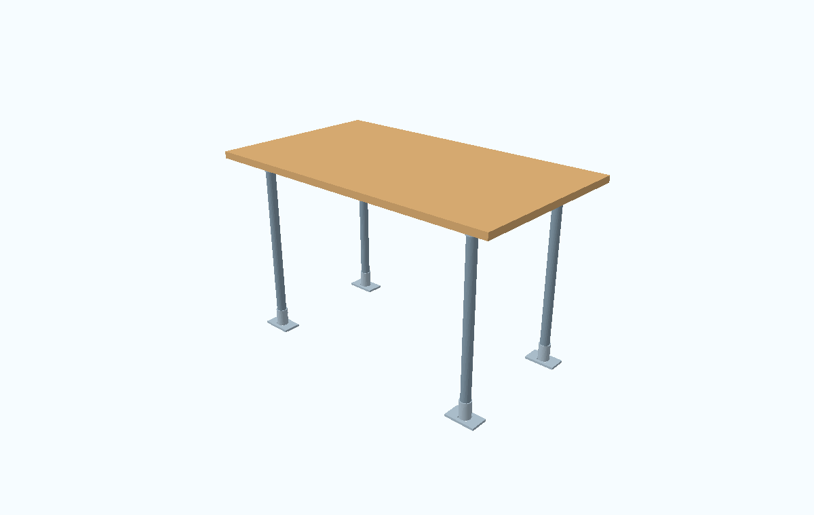
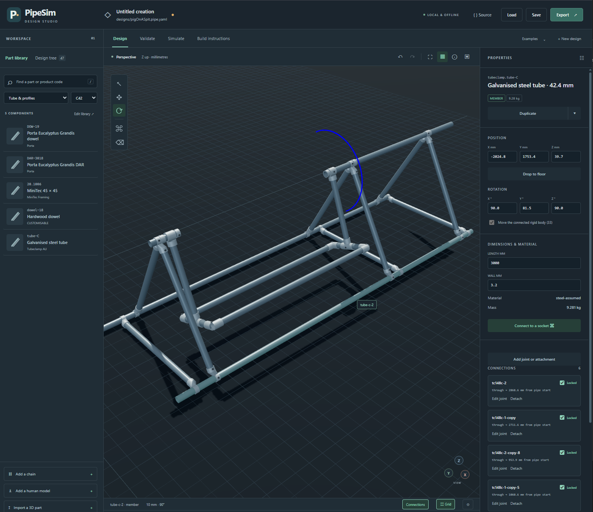

# PipeSim

A local design studio and command-line toolchain for modular tube structures. Author a design in YAML or JSON, edit it in 3D, check its connections and assembly order, simulate its motion, calculate beam response, and export illustrated build instructions.





## Run it

Python 3.11–3.13 is recommended. The GUI runs in a WebGL-capable browser on Windows, macOS or Linux. Rendering and simulation also work without a display or GPU. This version has been exercised on Windows with Python 3.13.

```powershell
python -m venv .venv
.venv\Scripts\python -m pip install -e ".[dev]"
.venv\Scripts\python -m pipesim editor --open
```

On macOS/Linux, use `.venv/bin/python` in place of `.venv\Scripts\python`. The installed `pipesim` command is equivalent to `python -m pipesim`. From this checkout, the latter works immediately if its Python dependencies are already installed.

The editor is at **http://127.0.0.1:8765**. Its Three.js assets are vendored; no account, CDN or JavaScript build is required. FFmpeg is needed for MP4 output; GIF and PNG sequences work without it.

## Try the complete pipeline

```powershell
python -m pipesim validate examples/workbench.pipe.yaml --build
python -m pipesim analyse examples/workbench.pipe.yaml -o output/bench-analysis.json
python -m pipesim build examples/workbench.pipe.yaml --engineering -o output/workbench-build
python -m pipesim render examples/workbench.pipe.yaml --lighting technical -o output/bench.png

python -m pipesim simulate examples/sliding-collar.pipe.yaml --duration 2 --record
python -m pipesim animate examples/sliding-collar.pipe.yaml -o output/collar.mp4
python -m pipesim motion-check examples/sliding-collar.pipe.yaml --joint loose-screw

python -m pipesim fit examples/human.pipe.yaml --human person --target 231 350 1100
python -m pipesim simulate examples/seated-posture.pipe.yaml --duration 2 -o output/seated.json
python -m pipesim animate examples/seated-posture.pipe.yaml --simulation output/seated.json -o output/seated.mp4
```

Open `output/workbench-build/instructions.html` and print it, including to PDF. The folder also contains the BOM and cutting plan as CSV/JSON, assembly-plan evidence, illustrations, engineering results and a portable copy of the design.

`--record` explicitly writes results back into the input design. Otherwise commands leave the source unchanged. Evidence includes a SHA-256 fingerprint covering the document, resolved part/material definitions and mesh bytes.

## What is implemented

| Area | Working features |
|---|---|
| Files | Versioned YAML/JSON, JSON Schemas, editable material/part libraries, explicit ports, reusable articulated objects, readable joint coordinates, animation tracks, results, atomic saves, portable bundles |
| Catalogue | 93 entries: Tubeclamp fittings including TC116 corner middles, TC148 swivel short tees, TC161 offset crosses, split tees and six tube diameters, MiniTec 45 mm profile and Power-Lock fastener, Porta dowel and dressed timber, GT2 pulley/belt references, configurable panels, loads, wheels, links and printable connector concepts |
| Editor | Library search and drag/drop, direct body dragging, translation/rotation handles, configurable snap increments and saved defaults, alignment to existing parts, connection previews, rigid-group movement, joint locks, anchors, parameter edits, library overrides, mesh import, undo/redo, source editing, simulation playback, frame capture, validation, FEA and build export |
| Validation | Schema and reference checks; bore/axis/engagement checks; duplicate sockets; collisions inside rigid groups; moving-part intersection warnings; gravity support polygons; motion sampling |
| Assembly planning | Reverse search with conservative clearance advancement, closed-socket insertion restrictions, split-fitting placement, stable intermediate states, explicit fixture and sequence support, bounded search with an `indeterminate` result |
| Dynamics | PyBullet rigid compounds and articulated joints; gravity, friction and contact; loose sliding/twisting sockets; physical stops; limits, motors, GT2/gear couplings; tension-only links; explicit break thresholds and continued motion after separation |
| Human fit | 19 segments, 18 anatomical joints, whole-person movement and flipping, limb posing, lossless expansion/regrouping, grip detach/reconnect previews, configurable stature/mass/limb measurements, standing/seated/crouching/pull-up poses, joint-limited arm IK, collision checks, seated dimension screening, clearance tests, ragdoll dynamics and bounded posture servos |
| Engineering | 3D Euler–Bernoulli frame elements, rigid offsets, distributed self-weight, point forces/moments, mechanisms, stress/deflection, Euler buckling, conditional connector axial-slip checks, multiaxial force ramps, optional dynamic tipping/sliding trials, contact-to-FEA load transfer |
| Output | PNG/JPEG, transparent backgrounds, GIF/MP4/PNG sequences, GLB/STL geometry, camera and lighting controls, BOM, kerf-aware stock cutting, illustrated printable steps and engineering diagrams |

## Engineering scope

This is a functioning **v0.1 engineering workbench**, with explicit model limits. It is not a manufacturing CAD kernel or a validated structural certification system.

Tubeclamp models use the supplier's published drawing dimensions and annotated sockets. Unsupplied casting contours, wall details, clearances and engagement assumptions remain labelled. The library is an extensible selection, not the supplier's entire catalogue. The AliExpress item and Printables model could not be retrieved; the included printable concept is identified as an original approximation, not their downloaded model.

FEA is a linear beam model. Panels are rigid load-transfer bodies; it does not calculate shell stress, timber splitting, casting fracture, plastic collapse or coupled deformable contact. Unknown connector capacities remain unknown. Explicit break limits produce physical separation; missing strength data never becomes an invented fracture threshold.

The human is a configurable articulated mannequin with physical mass, inertia, contact and joint limits. Its default proportions, segment fractions, mobility ranges and posture-control strengths are engineering approximations. Fit tests require measurements for the intended person. There is no soft-tissue, muscle, comfort, injury or active-balance model; a passive standing ragdoll is expected to fall.

The build planner checks a stated class of straight insertion paths and gravity-supported intermediate states on the supplied collision geometry. It does not prove arbitrary assembly impossibility, tool access, thread engagement, tolerance stacks or anchor capacity. General coordinated multi-part insertions can return `indeterminate`. See [model limits](docs/model-limits.md) for exact boundaries.

## Examples and documentation

| Design | Demonstrates |
|---|---|
| [Workbench](examples/workbench.pipe.yaml) | Tubeclamp flanges, cut tube, timber panel, 13-step build book |
| [Sliding collar](examples/sliding-collar.pipe.yaml) | Loose grub screw, cylindrical motion, real locking-ring stop |
| [Hinged triangle](examples/hinged-triangle.pipe.yaml) | Thread a pipe through three tees by solving hinge rotations and slides together |
| [GT2 stage](examples/gt2-stage.pipe.yaml) | Torque-limited motor and belt-driven carriage |
| [Human](examples/human.pipe.yaml) / [seated](examples/seated-human.pipe.yaml) | Articulated anatomy, reach and expected-negative design tests |
| [Seated posture](examples/seated-posture.pipe.yaml) | Bounded posture servos and seat contact |
| [Pull-up](examples/human-pull-up.pipe.yaml) / [relaxed comparison](examples/human-pull-up-relaxed.pipe.yaml) | 59-part Tubeclamp cage, two hand grips, held upper body and passive swinging legs |
| [Contact load](examples/contact-load.pipe.yaml) | Free load falling onto a structural platform |
| [Caster platform](examples/caster-platform.pipe.yaml) | Reusable three-body wheel/fork/swivel objects |
| [Chain](examples/chain.pipe.yaml) | Set length, move as one object, pose links, attach either end and simulate flexible motion |
| [Cantilever](examples/cantilever.pipe.yaml) | Analytical beam benchmark |
| [Material comparison](examples/material-comparison.pipe.yaml) | Steel tube, aluminium profile and sourced timber |

- [File format and library authoring](docs/file-format.md)
- [Editor guide and worked workflows](docs/workflows.md)
- [Simulation, FEA and model limits](docs/model-limits.md)
- [Supplier sources and geometry decisions](docs/sources.md)
- [Architecture and verification](docs/development.md)

Run `python -m pipesim --help`, or add `--help` after any command. Run the regression suite with `python -m pytest -q`. To update the vendored GUI dependency, run `npm install` and `npm run vendor`; ordinary use does not require Node.

The application code is MIT licensed. Supplier reference drawings and photographs retain their owners' rights; see [third-party notices](THIRD_PARTY_NOTICES.md).
